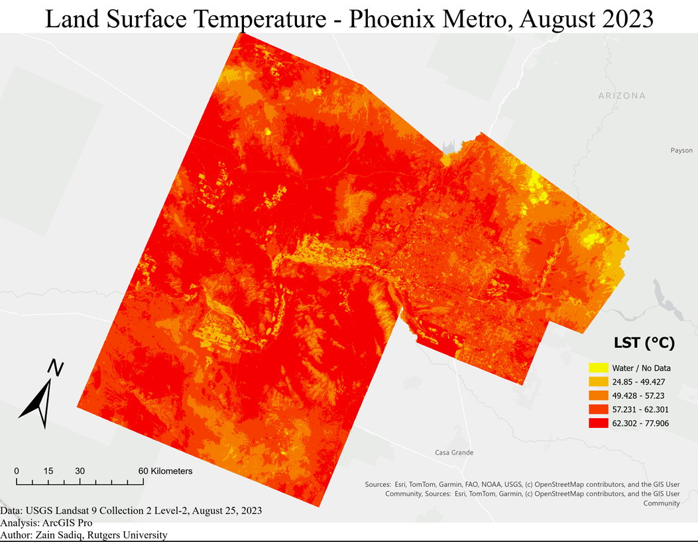
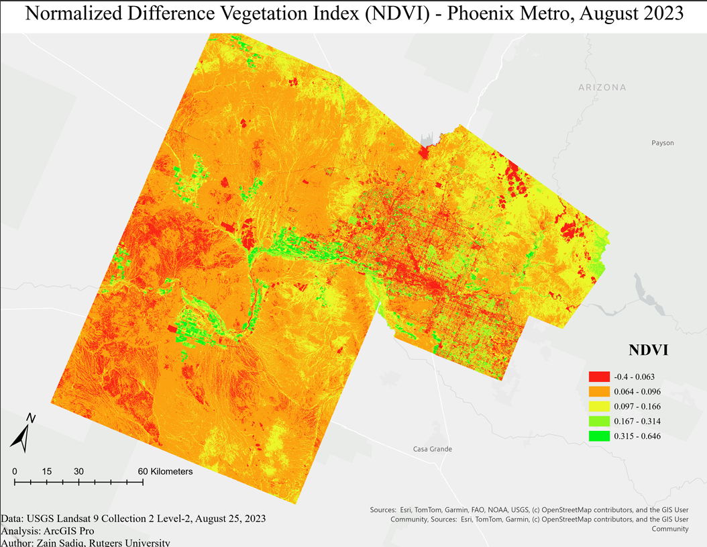
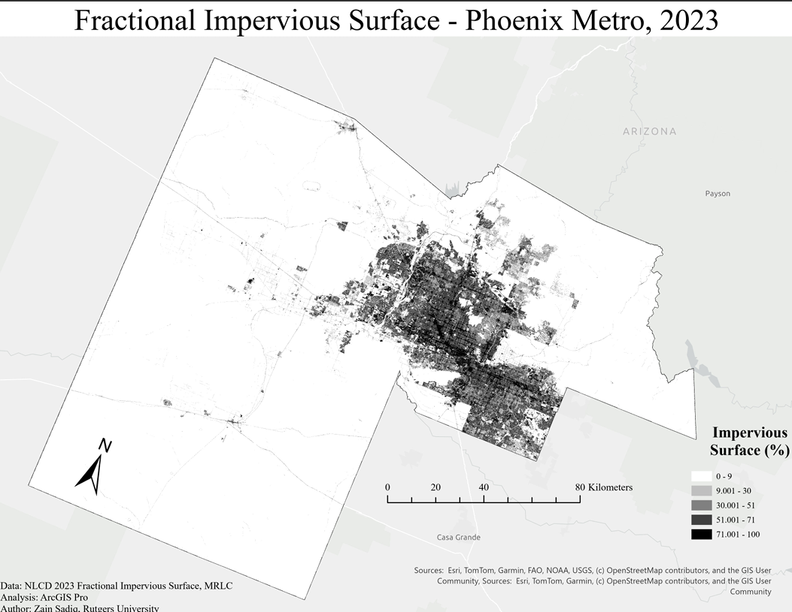
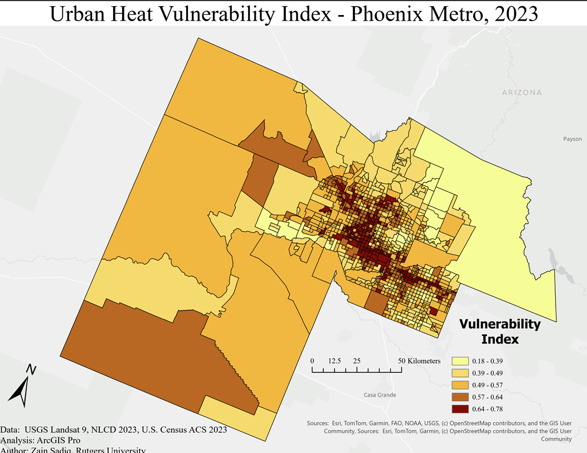
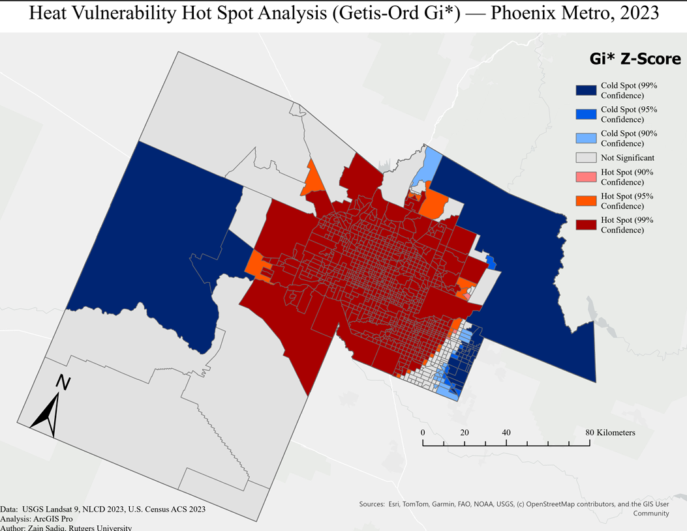

# Phoenix Urban Heat Island & Vulnerability Analysis

A remote sensing and GIS analysis identifying heat-vulnerable communities across the Phoenix Metropolitan Area using Landsat 9 thermal imagery, NLCD impervious surface data, and U.S. Census demographic indicators.

**Author:** Zain Sadiq, Rutgers University  
**Date:** June 2026  
**Tools:** ArcGIS Pro · Landsat 9 · NLCD 2023 · U.S. Census ACS 2023

---

## Overview

The Urban Heat Island (UHI) effect disproportionately impacts low-income and minority communities in rapidly urbanizing desert cities. This project integrates satellite-derived physical indicators with socioeconomic data to construct a composite **Heat Vulnerability Index** for all 1,009 census tracts in Maricopa County, Arizona, and applies Getis-Ord Gi* hot spot analysis to identify statistically significant clusters of high vulnerability.

---

## Key Findings

- Land Surface Temperature across the study area ranged from **-21.5°C to 77.9°C**, with a clear UHI signature concentrated in the Phoenix urban core
- A strong **inverse relationship between NDVI and LST** was confirmed — irrigated corridors and parks coincide with the lowest surface temperatures
- VULN_INDEX scores ranged from **0.178 to 0.782** (mean: 0.558, std. dev.: 0.095) across 1,009 census tracts
- Getis-Ord Gi* analysis identified a **dense 99% confidence hot spot cluster** in the Phoenix urban core, corresponding to areas of high thermal exposure, high impervious surface cover, low median income, and low vegetation
- **99% confidence cold spots** were identified in rural western Maricopa County and the Tonto National Forest area
- Gila River Indian Reservation tracts returned as **not statistically significant**, reflecting distinct land management patterns that break the urban vulnerability cluster

---

## Maps

| Map | Description |
|-----|-------------|
|  | **Land Surface Temperature** — Landsat 9 Band 10, August 25, 2023 |
|  | **NDVI** — Vegetation density derived from Bands 4 & 5 |
|  | **Fractional Impervious Surface** — NLCD 2023, 0–100% per pixel |
|  | **Composite Heat Vulnerability Index** — Weighted overlay of 6 variables |
|  | **Getis-Ord Gi* Hot Spot Analysis** — Statistical clustering of VULN_INDEX |

---

## Data Sources

| Dataset | Source | Year |
|---------|--------|------|
| Landsat 9 OLI/TIRS Collection 2 Level-2 | USGS EarthExplorer | 2023 |
| NLCD Fractional Impervious Surface (CONUS) | MRLC (mrlc.gov) | 2023 |
| ACS Table S1901 — Median Household Income | U.S. Census Bureau | 2023 |
| ACS Table S0101 — Age and Sex | U.S. Census Bureau | 2023 |
| ACS Table B02001 — Race | U.S. Census Bureau | 2023 |
| TIGER/Line Census Tracts | U.S. Census Bureau | 2023 |

---

## Methodology

### Physical Indicators
**Land Surface Temperature (LST)** was derived from Landsat 9 Band 10 using the USGS standard scale factor conversion:

```
LST (°C) = (ST_B10 × 0.00341802 + 149.0) − 273.15
```

**NDVI** was calculated from surface reflectance Bands 4 and 5:

```
NDVI = (Band 5 − Band 4) / (Band 5 + Band 4)
```

### Vulnerability Index Construction
Six variables were normalized to a 0–1 scale using min-max normalization. Income and NDVI were inverted so that lower values reflect higher vulnerability. The composite index was calculated as:

```
VULN_INDEX = (NORM_LST × 0.30) + (NORM_IMP × 0.20) + (NORM_INCOME × 0.20)
           + (NORM_NDVI × 0.15) + (NORM_65PLUS × 0.10) + (NORM_NONWHT × 0.05)
```

| Variable | Weight | Rationale |
|----------|--------|-----------|
| LST | 0.30 | Direct heat exposure measure |
| Impervious Surface | 0.20 | Primary UHI driver |
| Median Income (inverted) | 0.20 | Strongest socioeconomic vulnerability predictor |
| NDVI (inverted) | 0.15 | Cooling effect indicator |
| Population 65+ | 0.10 | Physiological vulnerability to heat stress |
| Non-white Population | 0.05 | Environmental justice framing |

### Spatial Statistics
A **Getis-Ord Gi* Hot Spot Analysis** was run on the VULN_INDEX field using Fixed Distance Band conceptualization and Euclidean distance method. ArcGIS Pro calculated a default neighborhood search threshold of 45,293.59 meters.

---

## Repository Structure

```
phoenix-uhi-analysis/
│
├── README.md
├── report/
│   └── Phoenix_UHI_Vulnerability_Analysis_Report.pdf
├── maps/
│   ├── Map1_LST_Phoenix.png
│   ├── Map2_NDVI_Phoenix.png
│   ├── Map3_Impervious_Phoenix.png
│   ├── Map4_VulnIndex_Phoenix.png
│   └── Map5_HotSpot_Phoenix.png
├── data/
│   ├── Maricopa_Analysis.shp (+ associated files)
│   └── HotSpot_VulnIndex.shp (+ associated files)
└── project_log.txt
```

---

## Skills Demonstrated

- Satellite imagery processing (Landsat 9 Collection 2 Level-2)
- Land Surface Temperature derivation from thermal infrared bands
- NDVI calculation from multispectral imagery
- Raster reprojection, resampling, and masking in ArcGIS Pro
- Zonal statistics and multi-source spatial joins
- Min-max normalization and weighted overlay analysis
- Getis-Ord Gi* spatial autocorrelation and hot spot analysis
- Environmental justice analysis integrating remote sensing and Census data
- Publication-quality cartography in ArcGIS Pro

---

## References

Imhoff, M. L., Zhang, P., Wolfe, R. E., & Bounoua, L. (2010). Remote sensing of the urban heat island effect across biomes in the continental USA. *Remote Sensing of Environment, 114*(3), 504–513.

Multi-Resolution Land Characteristics Consortium (MRLC). (2023). *Annual National Land Cover Database (NLCD) Collection 1 Fractional Impervious Surface.* mrlc.gov

U.S. Geological Survey (USGS). (2023). *Landsat 9 OLI/TIRS Collection 2 Level-2 Science Product.* Scene ID: LC09_L2SP_037037_20230825_20230827_02_T1. earthexplorer.usgs.gov

Voogt, J. A., & Oke, T. R. (2003). Thermal remote sensing of urban climates. *Remote Sensing of Environment, 86*(3), 370–384.
